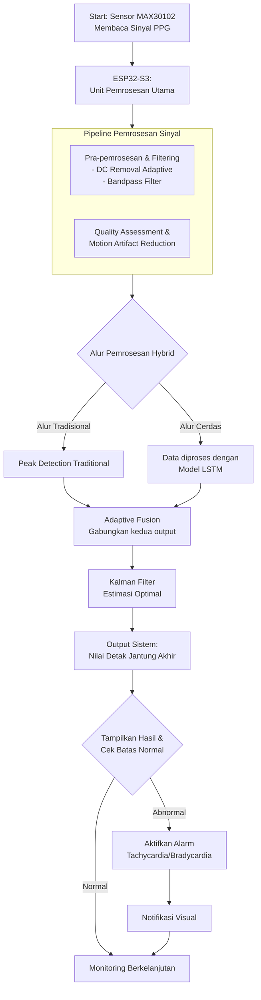
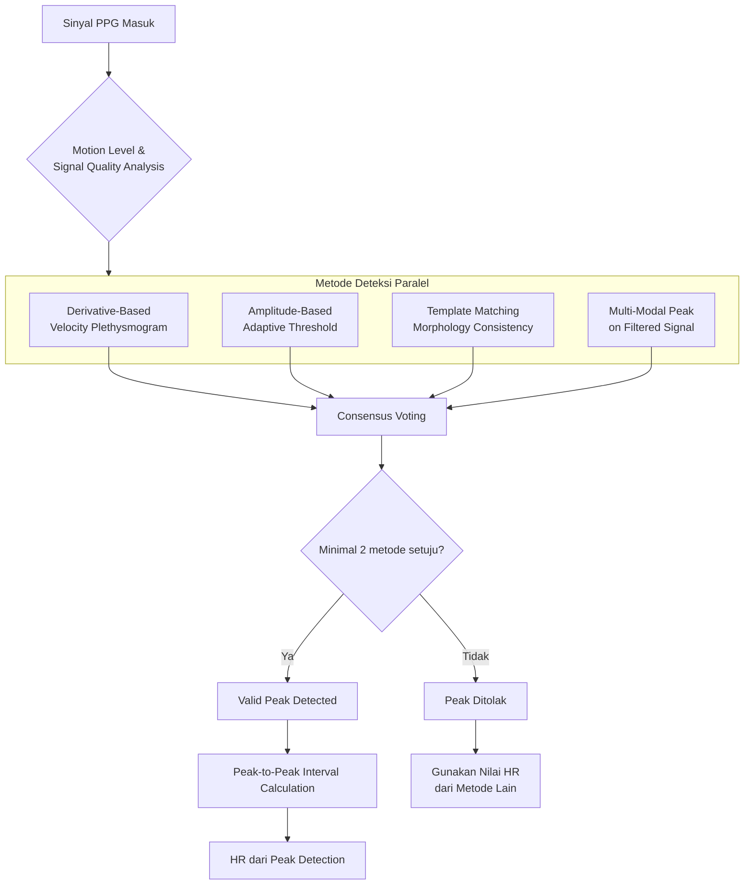
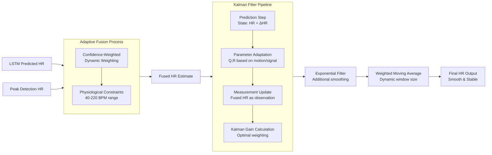

# 🫀 Analisis Detak Jantung Real-time dengan ESP32

> **Sistem Hybrid LSTM & Peak Detection untuk Pemantauan Detak Jantung Berkelanjutan dengan Konfirmasi Abnormal dan Alarm**

Proyek skripsi ini mengembangkan sistem **analisis detak jantung real-time** yang canggih untuk mikrokontroler ESP32-S3. Sistem ini memanfaatkan **arsitektur hybrid** yang menggabungkan kecerdasan model LSTM dengan robustitas algoritma peak detection tradisional, diikuti oleh filter Kalman untuk menghasilkan estimasi HR yang akurat dan stabil, bahkan dalam kondisi pergerakan.

## 📊 **Diagram Alur Sistem**

### Diagram 1: **Arsitektur Sistem Lengkap** (Alur Kerja Makro)



### Diagram 2: **Proses Peak Detection Multi-Metode** (Detail Algoritma)



### Diagram 3: **Alur Fusion & Kalman Filter** (Proses Optimasi Output)



## 🧠 **Arsitektur Model LSTM**

### **Input & Output**
- **Input**: Sinyal PPG mentah atau terfilter
- **Output**: Nilai Heart Rate (HR) yang diprediksi

### **Detail Arsitektur Lapisan**
1.  **Lapisan LSTM 1**: 128 unit → **LayerNorm** → Dropout (0.2)
2.  **Lapisan LSTM 2**: 96 unit → **LayerNorm** → Dropout (0.15)
3.  **Lapisan LSTM 3**: 64 unit → **LayerNorm** → Dropout (0.1)
4.  **Lapisan Dense Bertingkat**: 96 → 64 → 32 → 16 → 1 neuron (menggunakan regularisasi **L2**)

### **Strategi Training**
- **Callback System**:
    - `EarlyStopping` dengan patience=45 epoch
    - `ReduceLROnPlateau` untuk penyesuaian learning rate
    - **Dual Checkpoint**: Menyimpan model terbaik berdasarkan `val_mae` *dan* `val_loss`
- **Loss Function Terspecialisasi**:
    - **Weighted untuk High HR (1.2x - 1.5x)**:
        - Penalty lebih besar untuk *underestimating* HR > 100 BPM
        - Penalty lebih besar untuk *overestimating* HR < 80 BPM
- **Optimasi Data**:
    - **Data Balancing** dengan High HR Boost:
        - 160-180 BPM: ditambah 50k sampel data
        - 180-220 BPM: ditambah 30k sampel data

## 🔍 **Algoritma Peak Detection & Data Fusion Canggih**

### **Peak Detection Multi-Metode**
Sistem ini tidak bergantung pada satu metode saja, tetapi menggunakan **konsensus dari 4 metode** utama:
1.  **Derivative-Based Velocity Plethysmogram**: Analisis kecepatan perubahan sinyal.
2.  **Amplitude-Based Adaptive Threshold**: Ambang batas yang menyesuaikan dengan amplitudo.
3.  **Template Matching Morphology Consistency**: Kecocokan dengan template gelombang PPG ideal.
4.  **Multi-Modal Peak**: Deteksi puncak pada sinyal yang sudah difilter.

**Aturan Konsensus**: Minimal **2 metode** harus setuju untuk sebuah puncak divalidasi.

### **Fusi Data Hybrid yang Cerdas**
Nilai HR dari LSTM dan Peak Detection digabungkan secara adaptif:
- **Dynamic Weighting**: Bobot masing-masing sumber HR ditentukan berdasarkan:
    - **Motion Level** (tingkat pergerakan)
    - **Signal Quality** (kualitas sinyal PPG)
- **Physiological Constraints**: Hasil fusi dibatasi pada rentang fisiologis **40-220 BPM**.
- **Temporal Consistency**: Mempertimbangkan kesinambungan nilai HR dari waktu ke waktu.

### **Pemulusan & Stabilisasi Bertingkat**
1.  **Kalman Filter**:
    - **State Prediction**: Memodelkan HR dan perubahan HR (ΔHR).
    - **Parameter Adaptation**: Parameter noise (Q, R) diadaptasi berdasarkan kualitas sinyal dan gerakan.
    - **Measurement Update**: Nilai "Fused HR" digunakan sebagai observasi.
    - **Kalman Gain Calculation**: Menghitung bobot optimal antara prediksi dan observasi.
2.  **Exponential Filter**: Pemulusan tambahan untuk noise high-frequency.
3.  **Weighted Moving Average**: Rata-rata dengan **window size dinamis** yang menyesuaikan dengan variabilitas sinyal.

## 🛠️ **Spesifikasi & Konfigurasi Teknis**

| Komponen | Spesifikasi |
| :--- | :--- |
| **Target Perangkat** | ESP32-S3 (Dual-Core, 240MHz) |
| **Sensor** | MAX30102 (PPG & Heart Rate) |
| **Frekuensi Sampel** | 32 Hz (Dioptimalkan) |
| **Model Inference** | TensorFlow Lite Micro (`float32`) |
| **Rentang Deteksi HR** | 40 - 220 BPM |
| **Ambang Batas Alarm** | Tachycardia (>100 BPM), Bradycardia (<60 BPM) |

## 🚀 **Cara Menggunakan & Deployment**

### **1. Persiapan Development**
- **Hardware**: ESP32-S3 Dev Board, Sensor MAX30102, Kabel Jumper.
- **Software**: [PlatformIO](https://platformio.org/) (direkomendasikan) atau Arduino IDE dengan dukungan ESP32-S3.
- **Pustaka Wajib**: `TensorFlow Lite for Microcontrollers`, `Adafruit MAX3010x library`.

### **2. Pelatihan Model (Jupyter Notebook)**
Buka dan jalankan `ini yang dipakai.ipynb` untuk:
- Analisis dan visualisasi data PPG.
- Melatih model LSTM sesuai arsitektur di atas.
- Mengevaluasi model dan melakukan konversi ke format TFLite.

### **3. Deployment ke ESP32-S3**
1.  Clone repositori ini.
2.  Buka folder proyek utama `Skripsi10_final_float32_Optimal32hz_dualcore_180bpm` di PlatformIO/Arduino IDE.
3.  Pasang pustaka yang diperlukan.
4.  Hubungkan sensor MAX30102 ke pin I2C ESP32-S3 (SDA, SCL).
5.  Upload sketch ke board.
6.  Pantau output melalui Serial Monitor (Baudrate: 115200).

### **4. Logging Data (Opsional)**
Jalankan `HeartRateLogger.js` dengan Node.js untuk mencatat data serial dari ESP32 ke file untuk analisis lebih lanjut:
```bash
node HeartRateLogger.js
```

## 📁 **Struktur Repositori**

```
Eleanorxyz/Skripsi/
├── Skripsi10_final_float32_Optimal32hz_dualcore_180bpm/  # Kode utama ESP32-S3
├── HeartRateLogger.js                                   # Skrip logging data serial
├── ini yang dipakai.ipynb                               # Notebook untuk training model & analisis
├── (Model TFLite terkonversi)                          # Model terbaik untuk deployment
└── README.md (File ini)
```

## 🔮 **Pengembangan Selanjutnya**
- Porting ke platform **ESP32-C6** dengan WiFi 6 untuk telemetri cloud.
- Implementasi **edge-cloud co-inference** untuk model yang lebih kompleks.
- Pengujian klinis lebih lanjut dengan dataset yang beragam.

---

## 📄 **Lisensi**
Proyek ini dikembangkan sebagai bagian dari tugas skripsi. Silakan merujuk pada penulis untuk penggunaan lebih lanjut.

---
**Dikembangkan dengan ❤️ untuk pemantauan kesehatan yang lebih baik dan aksesibel.**
